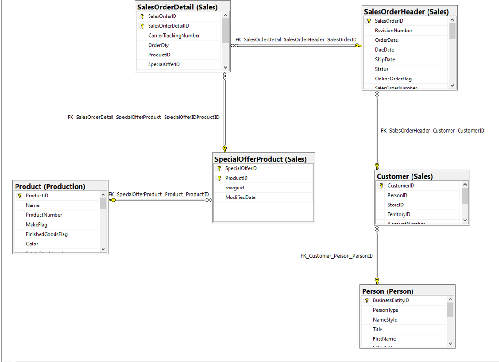
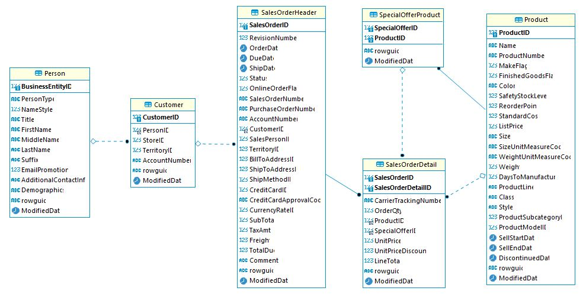
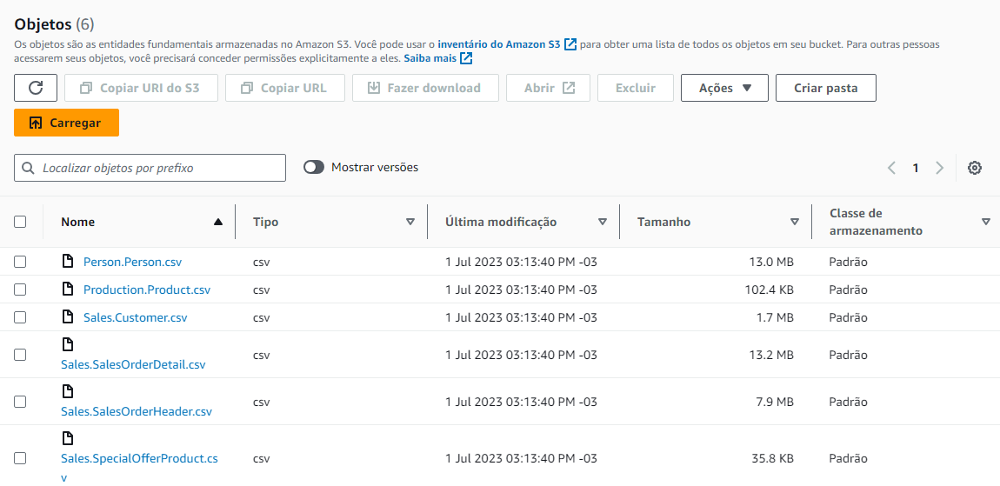
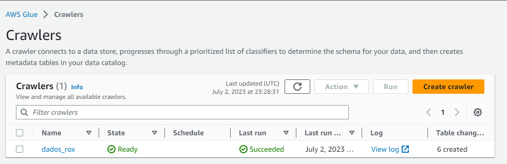
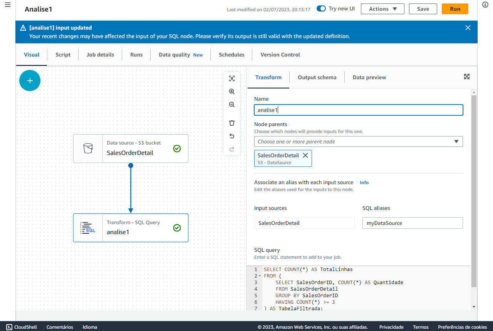
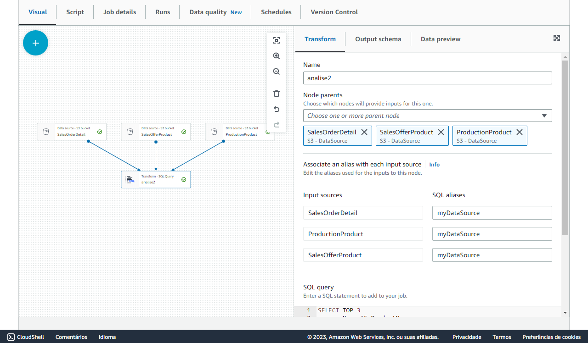
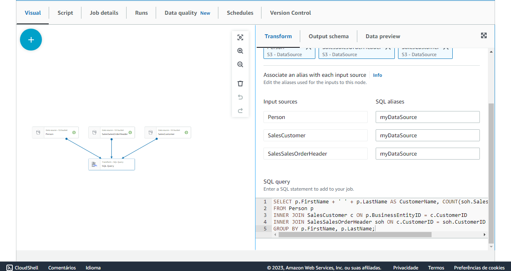
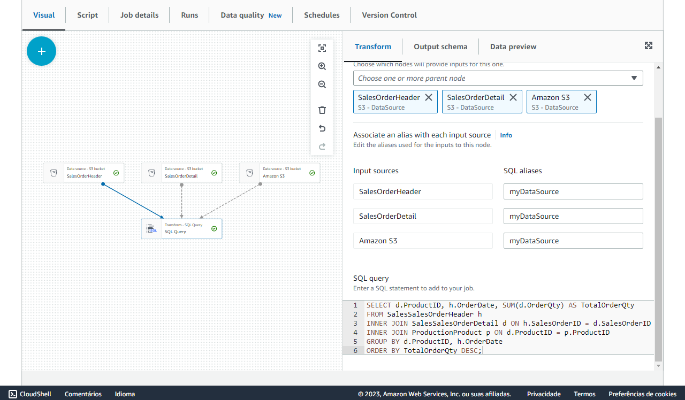
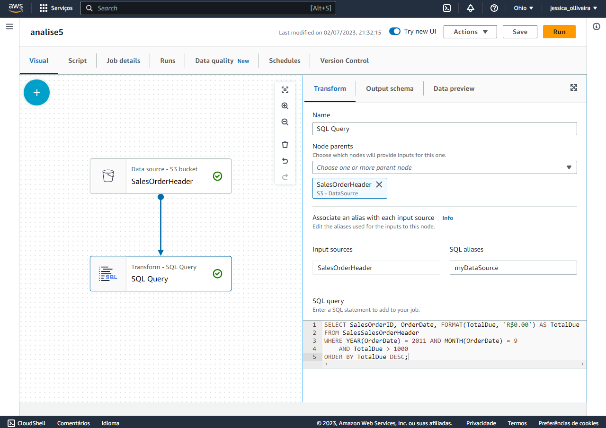

# Ingestão e análise de dados na AWS

## Sobre o projeto

Este projeto tem como objetivo utilizar os serviços da Amazon Web Services (AWS) para realizar a ingestão e análise de dados de uma empresa que produz bicicletas. Serão trabalhados conceitos fundamentais, tais como:
- Modelagem conceitual dos dados
- Criação de infraestrutura necessária
- Criação de todos os artefatos necessários para carregar os arquivos para o banco criado
- Desenvolvimento de SCRIPT para análise de dados

Os [arquivos](arquivos_csv)  a serem importados para o banco seguem o seguinte diagrama de modelagem:

A partir da análise desses dados, o projeto visa encontrar querys para os seguintes questionamentos:

1.	Escreva uma query que retorna a quantidade de linhas na tabela Sales.SalesOrderDetail pelo campo SalesOrderID, desde que tenham pelo menos três linhas de detalhes.
2.	Escreva uma query que ligue as tabelas Sales.SalesOrderDetail, Sales.SpecialOfferProduct e Production.Product e retorne os 3 produtos (Name) mais vendidos (pela soma de OrderQty),   agrupados pelo número de dias para manufatura (DaysToManufacture).
3.	Escreva uma query ligando as tabelas Person.Person, Sales.Customer e Sales.SalesOrderHeader de forma a obter uma lista de nomes de clientes e uma contagem de pedidos efetuados.
4.	Escreva uma query usando as tabelas Sales.SalesOrderHeader, Sales.SalesOrderDetail e Production.Product, de forma a obter a soma total de produtos (OrderQty) por ProductID e OrderDate.
5.	Escreva uma query mostrando os campos SalesOrderID, OrderDate e TotalDue da tabela Sales.SalesOrderHeader. Obtenha apenas as linhas onde a ordem tenha sido feita durante o mês de setembro/2011 e o total devido esteja acima de 1.000. Ordene pelo total devido decrescente.

## Tecnologias utilizadas
- AWS - Amazon Web Service
  -  AWS Glue
  -  Amazon S3
- PostgreSQL
- Python

## Desenvolvimento
Durante o desenvolvimento do projeto, optou-se por uma nova modelagem do banco de dados após a criação dos databases e tabelas, conforme demonstrado nos  [scripts de SQL](scripts/SQL_database) e na imagem abaixo:

A plataforma de serviço de nuvem escolhida para o projeto foi a AWS. Nela, foi criado um bucket dentro do Amazon S3 denominado 'jessbucket0623'. Dentro do bucket, foram criadas duas pastas: 'brutos', para carregar os dados brutos por meio do link de carregamento da própria plataforma, e 'processados', para receber os dados que foram transformados.

No AWS Glue, inicialmente, criou-se um crawler para catalogar os dados contidos na pasta 'brutos' do S3, além de deixar a estrutura preparada para automatizar a catalogação caso haja necessidade de aumentar o fluxo de dados. Durante a criação do crawler, também foi criado um banco de dados chamado 'brutos_caserox' para receber os arquivos do S3.

Após os arquivos estarem disponíveis no Glue, iniciaram-se as transformações nos dados utilizando o Glue Studio e a ferramenta ETL Jobs. Abaixo estão os modelos visuais e scripts das quarys desenvolvidas:

- Análise 1
  -  [Script SQL](scripts/SQL_analysis/analise_1)
  -  [Script Python](scripts/PYTHON_analysis/analise_1)
  -  Modelo visual

- Análise 2
  -  [Script SQL](scripts/SQL_analysis/analise2)
  -  [Script Python](scripts/PYTHON_analysis/analise_2)
  -  Modelo visual

- Análise 3
  -  [Script SQL](scripts/SQL_analysis/analise_3)
  -  [Script Python](scripts/PYTHON_analysis/analise_3)
  -  Modelo visual

- Análise 4
  -  [Script SQL](scripts/SQL_analysis/analise_4)
  -  [Script Python](scripts/PYTHON_analysis/analise_4)
  -  Modelo visual

- Análise 5
  -  [Script SQL](scripts/SQL_analysis/analise_5)
  -  [Script Python](scripts/PYTHON_analysis/analise_5)
  -  Modelo visual

## Observações
Este projeto é uma demonstração de como utilizar os serviços da AWS para realizar a ingestão e análise de dados. É importante ressaltar que existem outras abordagens e ferramentas disponíveis para alcançar resultados semelhantes, a exemplo do Lambda. A escolha da AWS e das tecnologias utilizadas foi baseada na proposta e requisitos específicos do projeto, mas outras soluções podem ser igualmente válidas, dependendo do contexto e dos objetivos do negócio.

